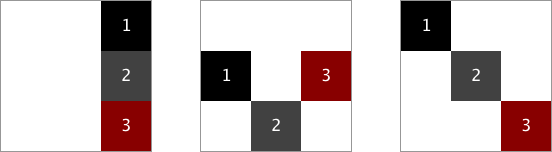

# Boilerplate de ejercicios de repaso de Flexbox y Position

Distribuir tres elementos dentro de un cuadrado según los esquemas proporcionados en el pdf dentro de assets.

## Instrucciones

1. Resuelve cada ejercicio en su propio html/css.
